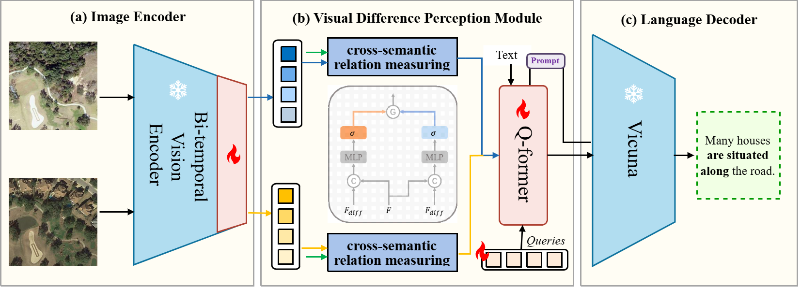
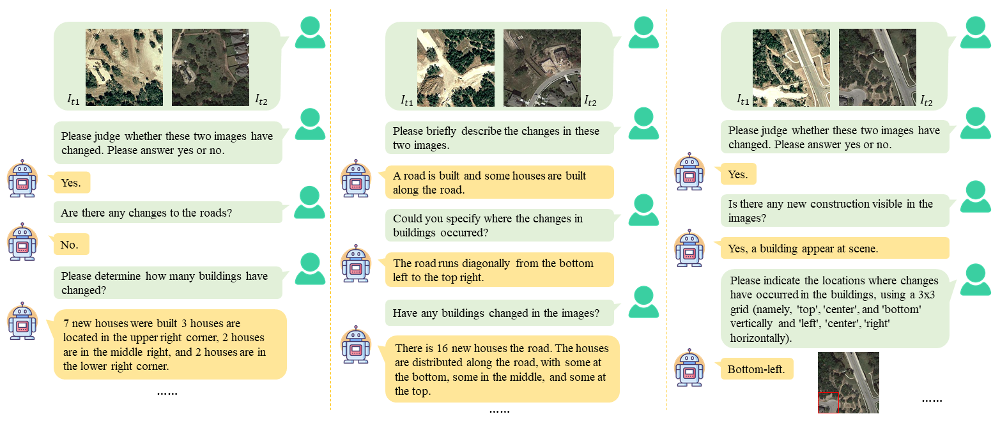

# DeltaVLM

**Interactive Remote Sensing Image Change Analysis via Instruction-guided Difference Perception**

[](https://arxiv.org/)
[](LICENSE)

---

## Introduction

DeltaVLM introduces **Remote Sensing Image Change Analysis (RSICA)** as a new paradigm that combines change detection and visual question answering to enable multi-turn, instruction-guided exploration of changes in bi-temporal remote sensing images.

### Capabilities

- **Change Captioning**: Generate natural language descriptions of changes
- **Binary Change Classification**: Determine whether changes occurred
- **Category-Specific Change Quantification**: Count specific object changes (buildings, roads)
- **Change Localization**: Identify spatial locations of changes in a 3×3 grid format
- **Open-ended QA**: Answer diverse user queries about observed changes
- **Multi-turn Dialogue**: Support interactive conversations for complex change analysis

## Architecture

<p align="center">
  
</p>

1. **Bi-temporal Vision Encoder (Bi-VE)**: Fine-tuned EVA-ViT-g/14 that captures temporal differences through selective fine-tuning (last 2 blocks trainable, first 37 frozen)
2. **Instruction-guided Difference Perception Module (IDPM)**: Features Cross-Semantic Relation Measuring (CSRM) mechanism to filter irrelevant variations and retain semantically meaningful changes
3. **Instruction-guided Q-former**: Aligns visual difference features with user instructions
4. **Frozen LLM Backbone**: Vicuna-7B as language decoder (frozen during training)

## Multi-turn Dialogue Example

<p align="center">
  
</p>
---

## Installation

### Requirements

- Python >= 3.8
- PyTorch >= 1.10.0
- CUDA >= 11.3

### Setup

```bash
git clone https://github.com/hanlinwu/DeltaVLM.git
cd DeltaVLM

conda create -n deltavlm python=3.10 -y
conda activate deltavlm

pip install torch==2.0.1 torchvision==0.15.2 --index-url https://download.pytorch.org/whl/cu118
pip install -r requirements.txt
pip install -e .
```

### Pre-trained Models

Download and place in `pretrained/`:

| Model | Description | Link |
|-------|-------------|------|
| EVA-ViT-G | Vision encoder | [HuggingFace](https://huggingface.co/BAAI/EVA) |
| Vicuna-7B-v1.5 | Language model (frozen) | [HuggingFace](https://huggingface.co/lmsys/vicuna-7b-v1.5) |
| BERT-base-uncased | Q-former initialization | [HuggingFace](https://huggingface.co/bert-base-uncased) |

---

## Data Preparation

### ChangeChat-105k Dataset

A large-scale instruction-following dataset with **105,107 instruction-response pairs** derived from LEVIR-CC and LEVIR-MCI.

| Instruction Type | Training Set | Test Set |
|-----------------|--------------|----------|
| Change Captioning | 34,075 | 1,929 |
| Binary Change Classification | 6,815 | 1,929 |
| Category-specific Change Quantification | 6,815 | 1,929 |
| Change Localization | 6,815 | 1,929 |
| Open-ended QA | 26,600 | 7,527 |
| Multi-turn Conversation | 6,815 | 1,929 |
| **Total** | **87,935** | **17,172** |

See [docs/DATA.md](docs/DATA.md) for download instructions and annotation format.

---

## Usage

### Training

```bash
# Stage 2: Instruction tuning on ChangeChat-105k
python scripts/train.py --cfg_path configs/train_stage2.yaml

# Multi-GPU
torchrun --nproc_per_node=4 scripts/train.py --cfg_path configs/train_stage2.yaml
```

### Inference

```bash
python scripts/predict.py \
    --image_A path/to/before.png \
    --image_B path/to/after.png \
    --prompt "Please briefly describe the changes in these two images."
```

---

## Citation

```bibtex
@article{deltavlm2024,
  title={DeltaVLM: Interactive Remote Sensing Image Change Analysis via Instruction-guided Difference Perception},
  author={Deng, Pei and Zhou, Wenqian and Wu, Hanlin},
  journal={IEEE Transactions on Geoscience and Remote Sensing},
  year={2024}
}
```

---

## Acknowledgement

- [BLIP-2](https://github.com/salesforce/LAVIS)
- [EVA](https://github.com/baaivision/EVA)
- [Vicuna](https://github.com/lm-sys/FastChat)
- [LEVIR-CC](https://github.com/Chen-Yang-Liu/RSICC)
- [LEVIR-MCI](https://github.com/Chen-Yang-Liu/LEVIR-MCI)

## License

[BSD 3-Clause License](LICENSE)
